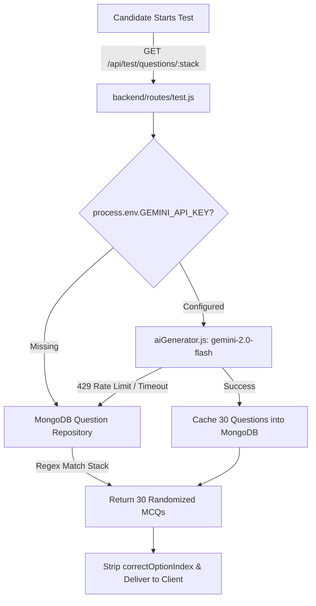

# 🏢 Hexaware Secure Internship Portal — Complete Master Technical Documentation

> **Hexaware Internship & Corporate Evaluation Management Portal**  
> *A unified full-stack enterprise web application designed for candidate intern onboarding, AI-driven technical specialization assessments, admin corporate mentor allocation, daily attendance tracking, task deliverable evaluation, and direct candidate-mentor collaboration.*

---

## 📑 Table of Contents

1. [Executive Summary & Technology Stack](#1-executive-summary--technology-stack)
2. [High-Level System Architecture](#2-high-level-system-architecture)
3. [Database Schema & Data Models](#3-database-schema--data-models)
4. [Core Functional Modules](#4-core-functional-modules)
   - [A. Role-Based Access & Authentication](#a-role-based-access--authentication)
   - [B. Candidate Onboarding & Profile Setup](#b-candidate-onboarding--profile-setup)
   - [C. AI-Powered Specialization Assessment Engine](#c-ai-powered-specialization-assessment-engine)
   - [D. System Admin Management Portal](#d-system-admin-management-portal)
   - [E. Corporate Mentor Workspace & Candidate Roster](#e-corporate-mentor-workspace--candidate-roster)
   - [F. Candidate Intern Dashboard & Daily Tracker](#f-candidate-intern-dashboard--daily-tracker)
   - [G. Direct Candidate-Mentor Chat System](#g-direct-candidate-mentor-chat-system)
   - [H. Role-Scoped Real-Time Notification Engine](#h-role-scoped-real-time-notification-engine)
   - [I. Custom Dark Glassmorphism Modal System](#i-custom-dark-glassmorphism-modal-system)
5. [Generative AI & Hybrid Question Provider](#5-generative-ai--hybrid-question-provider)
6. [Design System & WebGL Graphics](#6-design-system--webgl-graphics)
7. [API Endpoint Reference Guide](#7-api-endpoint-reference-guide)
8. [Local Deployment & Verification Guide](#8-local-deployment--verification-guide)

---

## 1. Executive Summary & Technology Stack

The **Hexaware Secure Internship Portal** is a production-grade enterprise application built to digitize and automate the lifecycle of Hexaware's internship selection, technical evaluation, and corporate mentorship workflows. 

### Technology Stack Specifications:

#### **Frontend Architecture**
- **Core Library:** React 18 (Vite build system)
- **Styling:** Vanilla CSS with custom design system, Glassmorphism UI tokens, CSS Variables
- **Icons:** Lucide React (`lucide-react`)
- **Data Visualization:** Recharts (`recharts`)
- **3D & Canvas Graphics:** WebGL GLSL Particle Shaders (`Three.js` / WebGL Canvas)

#### **Backend Architecture**
- **Runtime & Framework:** Node.js (v22+) + Express.js RESTful Web APIs
- **Authentication:** JSON Web Tokens (JWT) with Bearer Scheme & `bcryptjs` password hashing
- **Database ODM:** Mongoose (v8+) on MongoDB (`mongodb://localhost:27017/hexaware-portal`)
- **Document Exporters:** `pdfkit` (PDF Generation), `exceljs` (Excel Roster Export)

#### **Generative AI Integration**
- **AI Engine:** Google Gemini AI API (`@google/generative-ai` SDK, `gemini-2.0-flash` model)
- **Fallback Repository:** 770+ MongoDB pre-seeded technical MCQs across all 22 specializations

---

## 2. High-Level System Architecture

```mermaid
graph TD
    User([User Browser]) -->|React SPA / Vite| Frontend[Frontend React Layer]
    
    subgraph Frontend Components
        AuthView[Auth & Registration]
        CandidateDash[Candidate Dashboard]
        TestEngine[Assessment Engine]
        MentorDash[Mentor Workspace]
        AdminDash[Admin Executive Portal]
        ChatWidget[Direct Chat Drawer]
        NotifWidget[Notification Drawer]
    end

    Frontend -->|JWT REST API Calls| ExpressApp[Express.js Web Server]
    
    subgraph Express Middleware & Routes
        AuthMiddleware[JWT Auth & Role Guard]
        AuthRoutes[/api/auth]
        TestRoutes[/api/test]
        AdminRoutes[/api/admin]
        MentorRoutes[/api/mentor]
        MsgRoutes[/api/messages]
    end

    ExpressApp -->|Mongoose ODM Queries| MongoData[(MongoDB: hexaware-portal)]
    ExpressApp -->|Dynamic MCQ Generation| GeminiAPI[Google Gemini AI Engine]

    subgraph MongoDB Collections
        C1[(users)]
        C2[(questions)]
        C3[(assessmentresults)]
        C4[(notifications)]
        C5[(messages)]
        C6[(candidates)]
        C7[(reports)]
    end
```

---

## 3. Database Schema & Data Models

### 1. `User` Schema (`backend/models/User.js`)
Stores authentication credentials, user roles, profile attributes, and evaluation status.
- `name`: String (Required)
- `email`: String (Required, Unique, Indexed)
- `password`: String (Hashed with bcryptjs)
- `role`: Enum (`'Candidate'`, `'Mentor'`, `'Admin'`)
- `isProfileCompleted`: Boolean (Default: `false`)
- `assessmentStatus`: Enum (`'Pending Assessment'`, `'Passed - Pending Submission'`, `'Pending Mentor Allocation'`, `'Mentor Allocated'`, `'Not Shortlisted'`)
- `assignedMentorId`: ObjectId (Ref: `'User'`, Default: `null`)
- `college`, `degree`, `branch`, `cgpa`, `preferredStack`, `city`, `state`, `country`, `mobile`, `resumeUrl`

### 2. `Question` Schema (`backend/models/Question.js`)
Stores technical multiple-choice questions per specialization track.
- `stack`: String (Indexed, e.g. `'.NET Full Stack'`, `'Java Full Stack'`)
- `questionText`: String (Required)
- `options`: Array of 4 Strings (Required)
- `correctOptionIndex`: Number (0-3)
- `explanation`: String
- `difficulty`: String (`'Easy'`, `'Medium'`, `'Hard'`)

### 3. `AssessmentResult` Schema (`backend/models/AssessmentResult.js`)
Records test submission metrics.
- `candidateId`: ObjectId (Ref: `'User'`)
- `assessmentName`: String
- `score`: Number
- `totalQuestions`: Number (Default: 30)
- `percentage`: Number
- `passed`: Boolean
- `status`: Enum (`'Pending'`, `'Approved'`, `'Rejected'`)

### 4. `Notification` Schema (`backend/models/Notification.js`)
Stores role-scoped notification notifications.
- `userId`: ObjectId (Recipient User ID)
- `recipient`: ObjectId (Alternative recipient ref)
- `title`: String
- `message`: String
- `type`: String (`'AssessmentPassed'`, `'CandidateAssigned'`, `'MentorAllocated'`, `'TaskAssigned'`)
- `isRead`: Boolean (Default: `false`)
- `candidateId`, `candidateName`, `candidateEmail`

### 5. `Message` Schema (`backend/models/Message.js`)
Stores real-time direct candidate-mentor conversations.
- `senderId`: ObjectId (Ref: `'User'`)
- `recipientId`: ObjectId (Ref: `'User'`)
- `text`: String
- `attachmentUrl`, `attachmentName`, `attachmentType`: Strings
- `isRead`: Boolean (Default: `false`)
- `reactions`: Array of `{ userId, emoji }`

---

## 4. Core Functional Modules

### A. Role-Based Access & Authentication
- **Multi-Role Security:** Supports **Candidate**, **Mentor**, and **Admin** accounts.
- **JWT Authorization:** Tokens generated upon login and passed in `Authorization: Bearer <token>` HTTP headers.
- **Route Guards:** Backend `roleAuth(['Admin', 'Mentor'])` middleware prevents unauthorized privilege escalation.

### B. Candidate Onboarding & Profile Setup
- Multi-step registration capturing:
  1. Personal Profile (Full Name, Email, Password, Mobile, DOB, Gender).
  2. Academic Info (College Name, Degree, Branch/Specialization, Current Year, Graduation Year, CGPA).
  3. Location & Specialization Track selection.
- **Background Aesthetics:** WebGL Galaxy particle animation active exclusively on Auth & setup screens.

### C. AI-Powered Specialization Assessment Engine
- **Supported Specializations:** `.NET Full Stack`, `Java Full Stack`, `Python Full Stack`, `MERN Stack`, `Software Testing (QA)`, `C++ Systems Programming`, and 16 additional tracks.
- **30-Question MCQ Format:** 30 randomized questions per test attempt with a 30-minute countdown timer.
- **Anti-Cheating Design:** Strips correct answer indices (`correctOptionIndex`) before delivering test payloads to client browsers.
- **Ref-Based Timer:** Synchronized timer refs in React (`TestScreen.jsx`) to prevent stale closures and double-advancements.

### D. System Admin Management Portal
- **Executive Key Performance Metrics:**
  - Total Candidates Enrolled
  - Active Corporate Mentors
  - Pending Mentor Allocation Roster
  - Allocated Candidates Roster
- **Live Mentor Allocation:** Admin can inspect passed candidate scorecards (*e.g., 29/30 score, 97%*) and assign an official Corporate Mentor from a live dropdown list.
- **Mentor Account Provisioning:** Admin can provision new Corporate Mentor accounts on-the-fly with 1-click password copy.
- **Clean Dropdown Menu:** Removed candidate-only items (*"My Profile"*) from the Admin top navigation dropdown.

### E. Corporate Mentor Workspace & Candidate Roster
- **My Candidates Directory:** Lists all assigned interns sorted newest first (`.sort({ createdAt: -1 })`).
- **Candidate Profile Viewer (`CandidateDetailsModal.jsx`):** Displays candidate college, degree, branch, CGPA, technical skills, assessment history breakdown, and a downloadable resume PDF button.
- **Task Deliverable Assignment (`AssignTaskModal.jsx`):** Allows mentors to assign GitHub repository links and coding tasks directly to interns.

### F. Candidate Intern Dashboard & Daily Tracker
- **Daily Attendance Logger:** 1-click attendance logger allowing candidates to log status (`Present` / `Absent`) and work mode (`Office` / `Remote`), updating live attendance streak counts.
- **Task Deliverable Board:** Allows interns to submit repository links and code deliverables for mentor review.
- **Dedicated Mentor Chat:** Direct sidebar navigation tab opening a full-screen or floating chat interface.

### G. Direct Candidate-Mentor Chat System
- **Floating Chat Overlay (`ChatDrawer.jsx`):** Allows real-time two-way communication between candidate and mentor.
- **Features:** Supports text messages, document/image file attachments, emoji reactions, message editing, message deletion, and sticky viewport bounds (`maxHeight: calc(100vh - 40px)`).

### H. Role-Scoped Real-Time Notification Engine
Strict notification routing ensures users only see messages relevant to their role:
- **Admin Notifications:** Receives `AssessmentPassed` alerts (*"Eligibility Exam Passed & Submitted! Pending corporate mentor allocation"*).
- **Mentor Notifications:** Receives `CandidateAssigned` alerts (*"📌 New Intern Candidate Assigned! You have been allocated as official corporate mentor for X"*).
- **Candidate Notifications:** Receives `MentorAllocated` alerts (*"🎉 Corporate Mentor Allocated! Martin has been assigned as your corporate mentor"*).

### I. Custom Dark Glassmorphism Modal System
- Replaced native browser `alert(...)` popups with dark glassmorphism modal cards (`#0a0c1a`) featuring glowing icons (`CheckCircle2`, `Clock`, `AlertCircle`) and an **"Okay, Got It"** action button.

---

## 5. Generative AI & Hybrid Question Provider



### AI Pipeline Features:
1. **Model Target:** `gemini-2.0-flash` with strict JSON Schema enforced via `SchemaType.ARRAY`.
2. **Dynamic Fallback Chain:** If Gemini API key hits free-tier rate limits (429) or times out (>15s), the server smoothly falls back to 30 pre-seeded authentic technical questions stored in MongoDB.
3. **Clean Database:** Generic placeholder question texts (*e.g., "Technical Assessment Question #12..."*) were purged from MongoDB and replaced with 30 authentic, high-caliber technical questions per track.

---

## 6. Design System & WebGL Graphics

### A. Dark Glassmorphism CSS Architecture
- **Palette Tokens:** Dark space background (`#070913`), elevated glass cards (`rgba(15, 17, 32, 0.65)`), border highlights (`rgba(255, 255, 255, 0.08)`), glowing brand accents (`#6366f1` Indigo, `#818cf8` Soft Violet, `#10b981` Emerald).
- **Typography:** Modern clean sans-serif layout hierarchy using Google Fonts (Inter / Outfit).

### B. GPU WebGL Particle Shader (`Galaxy.jsx`)
- **GPU Shaders:** Custom GLSL vertex and fragment particle shaders creating twinkling stars and galaxy particles.
- **Performance Controls:** Frame-rate throttled to **30 FPS**, particle drawing layers reduced to `2.0`, downsampled render buffer scale (`0.7`) to cut pixel shader iterations by 51%.
- **Interactive Physics:** Cursor repulsion physics using `pointerEvents: 'none'` at negative z-index (`-1`) ensuring zero interference with form clicks.

---

## 7. API Endpoint Reference Guide

### Authentication Endpoints (`/api/auth`)
- `POST /api/auth/register` — Register new candidate account.
- `POST /api/auth/login` — Authenticate user and return JWT bearer token.
- `GET /api/auth/user` — Fetch current user profile.
- `PUT /api/auth/profile` — Update candidate profile information.
- `PUT /api/auth/change-password` — Change account password.

### Assessment Endpoints (`/api/test`)
- `GET /api/test/questions/:stack` — Fetch 30 randomized MCQs for specialization track.
- `POST /api/test/submit` — Submit test answers, score attempt, update candidate status.
- `POST /api/test/submit-to-admin` — Submit scorecard to Admin for mentor allocation.

### Admin Management Endpoints (`/api/admin`)
- `GET /api/admin/overview` — Fetch global statistics, pending allocation roster, candidates, and mentors.
- `PUT /api/admin/allocate-mentor` — Allocate corporate mentor to candidate.
- `POST /api/admin/create-mentor` — Provision new corporate mentor account.

### Mentor Workspace Endpoints (`/api/mentor`)
- `GET /api/mentor/dashboard` — Fetch mentor dashboard metrics and recent activity.
- `GET /api/mentor/candidates` — Fetch candidates assigned to logged-in mentor (`.sort({ createdAt: -1 })`).
- `GET /api/mentor/notifications` — Fetch role-scoped notifications.
- `PUT /api/mentor/notifications/read` — Mark notifications as read.

### Direct Chat Endpoints (`/api/messages`)
- `GET /api/messages/:recipientId` — Fetch message history with candidate or mentor.
- `POST /api/messages/send` — Send direct message with optional file attachment.
- `PUT /api/messages/react` — Add emoji reaction to message.
- `DELETE /api/messages/:msgId` — Delete message.

---

## 8. Local Deployment & Verification Guide

### 1. Prerequisites
- **Node.js:** v18.x or v22.x
- **MongoDB:** Running locally on `mongodb://localhost:27017/hexaware-portal`

### 2. Environment Configuration (`backend/.env`)
```env
PORT=5000
MONGO_URI=mongodb://localhost:27017/hexaware-portal
JWT_SECRET=hexaware_secret_jwt_token_key_123!
GEMINI_API_KEY=your_gemini_api_key_here
```

### 3. Database Seeding Commands
From the `backend/` directory:
```bash
# Seed 30 authentic technical questions per specialization track
node C:/Users/priya/.gemini/antigravity/brain/18c284dc-1bb1-4604-9fbd-92236cc492b8/scratch/seed_real_questions.js
```

### 4. Running the Application
```bash
# Start Backend API Server
cd backend
npm run dev

# Start Frontend Vite Dev Server (in separate terminal)
cd frontend
npm run dev
```

Open **`http://localhost:5173`** in your browser to access the portal.
